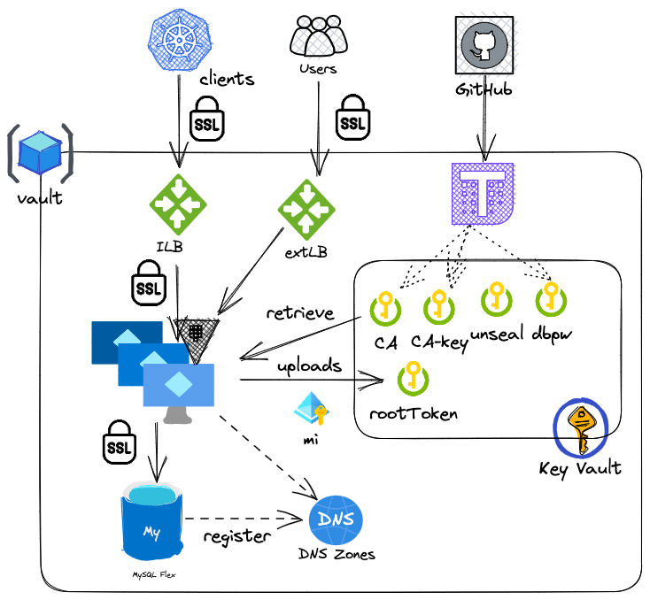

# Infra: Vault

Configuration for deploying a scalable Vault cluster. This deploys:

- Mysql flexible server (the new way of mysql deployment in azure) with private access to a vnet of choice (the subnet needs Microsoft/SQLFlexible_server endpoints, the latter to be enabled when the subnet is empty)
- A database for vault (but since the terraform runner doesn't have network access to MySQL, the vaultadmin mysql user and its grant to the database can only be set from within the VMSS instance from the install_script.sh cloud-init script
- An Internal LoadBalancer with rule translating port 443 to 8200 and a probe to detect the actual active server
- Private DNS zones with vnet registration for the VMs (and the AKS cluster living in the same subnet of the VMSS) to resolve the database URL and the app gw private address
- Backup for the VMSSs instances and the database (7 days retention)
- A key vault that stores the unseal key and a generated CA+key to encrypt Vault traffic, plus all the access policies necessary (including assigning the managed identity associated with the VMSS the reader role for the unseal key)
- A VMSS (Ubuntu 22.04, mandatory, as the cloud-init script is distro-specific) with a cloud init script that installs and enables vault. Unseal keys are coming from the KV, leveraging the managed identity
- Network security group allowing port 8200 and 22 on the nodes.



## Deployment

Packages are deployed using Github Actions, and they should not be deployed manually in normal circustmcens. 


### Post installation

You can follow the installation on each VM by looking at the `/var/log/cloud-init-output.log` log file. Watch for the root token, you'll need it to manage Vault (until we enable other auth methods via Terraform Vault module).

### Manual testing

This package has been tested locally against a non-production subscription. The requisites (the resources imported via `data` structures) are:

- a resource group (`resource_group` variable)
- a vnet (`vnet_name`) with 3 subnets:
  - a subnet for the database (`db_subnet_name`) with delegation to Mysql/FlexibleServer (the latter is not compatible with hosting other resources like VMs, hence the need to two subnets)
  - a subnet for VMSS and keyvault (`subnet_name`)
- a service principal with `Owner` rights on the subscription (needs to create resources and assign policies to Keyvault) that you can run Terraform on (usually exported as `ARM_CLIENT_ID`, `ARM_CLIENT_SECRET` and so on)

You can combine multiple `.tfvars` together (you can prepare a `local.tfvars` and a `local.hcl` for local testing, and add that to your `~/.gitignore_global`) like this:

```terraform
tf init -backend-config=local.hcl --reconfigure
tf plan  --var-file=common.tfvars --var-file=local.tfvars
tf apply -auto-approve --var-file=common.tfvars --var-file=local.tfvars
```

### Access

Setting `public_access` to `true` will deploy a public IP per VMSS member (from a pre-existing `public_ip_prefix_id`) and public loadbalancer to access Vault externally; it will be associated to a DNS name of the form vault-<env>-<org_name>.<region>.cloudapp.azure.com. Changing the vaule will remove and re-add the public access as needed.

### Notes

- The SSH key provided is the only one that can access the VMSS (and thus, create/manage secrets in Vault). It's suggested to enable AAD authentication, and use a bastion host (instead of )
- Vault needs `init`ialization after unsealing, hence the `vault operator init` command in the script. That will fail if the VM is recreated, as the Vault database has been already initialized
- For now (January 2023), the only way to interact is to use the root token, we are going to work on an authetication method (Github) for using the Vault as humans
- In Vault, there's no separate file for the CA to present to the clients, so you need to concatenate the CA with the server cert, see `install_vault.sh` line 28
- Probes for the ILB might fails because:
  - Vaults that are sealed return a `503`
  - Standy vaults return a `429`
  - Only unsealed, active vaults return `200 OK`
- Failover happens instantly, as the loadbalancer detects and switch the active backed. This is demonstrated by this command:


```bash
root@client:/home/azureuser# for run in {1..1000}; do echo $(vault kv get kv/my-secret| grep created); sleep 1; done
created_time 2023-01-06T08:25:04.755959651Z
created_time 2023-01-06T08:25:04.755959651Z
Get "https://vault.dev.vault/v1/sys/internal/ui/mounts/kv/my-secret": dial tcp 172.20.3.20:443: connect: connection refused

Get "https://vault.dev.vault/v1/sys/internal/ui/mounts/kv/my-secret": dial tcp 172.20.3.20:443: connect: connection refused

Get "https://vault.dev.vault/v1/sys/internal/ui/mounts/kv/my-secret": dial tcp 172.20.3.20:443: connect: connection refused

Get "https://vault.dev.vault/v1/sys/internal/ui/mounts/kv/my-secret": dial tcp 172.20.3.20:443: connect: connection refused

Get "https://vault.dev.vault/v1/sys/internal/ui/mounts/kv/my-secret": dial tcp 172.20.3.20:443: connect: connection refused

Get "https://vault.dev.vault/v1/sys/internal/ui/mounts/kv/my-secret": dial tcp 172.20.3.20:443: connect: connection refused

created_time 2023-01-06T08:25:04.755959651Z
created_time 2023-01-06T08:25:04.755959651Z

```

See how 5 requests are skipped, as the load balancer time out is exactly 5 seconds (the minimum for Azure LB). A video is available here

- Because of this [bug](https://github.com/MicrosoftDocs/azure-docs/issues/80413#issuecomment-1373003991) subnet with delegation to MySQL/FlexibleServers **cannot** host an internal load balancer, which means we need to have a dedicated (or a different one, with no ILBs) subnet for the database and one for the VMSS (and AKS).
  

### Improvements

- AD authentication for the VMSS
- Github auth for Vault
- Terraform management of Vault via self-hosted Github Runners

### Costs

Estimated cost for the resource group is 30-40 euros (Standard_B1s for the 2 instances in the VMSS, Standard_B1ms for the database with 20GB and 360 IOPS).

### References

[Azure Managed Identities with the HashiCorp Stack: Part 2](https://www.hashicorp.com/blog/azure-managed-identities-with-the-hashicorp-stack-part-2)

[Integrating Azure AD Identity with HashiCorp Vault](https://www.hashicorp.com/blog/integrating-azure-ad-identity-vault-part-3-azure-managed-identity-via-azure-auth-method?WT.mc_id=modinfra-58910-apedward)
[Setup Vault in HA with MySQL backend in 10 minutes | Hashicorp | Tutorial | Tharun](https://dev.to/developertharun/setup-vault-in-ha-with-mysql-backend-in-10-minutes-hashicorp-tutorial-tharun-559h)
[Auto-unseal using Azure Key Vault](https://developer.hashicorp.com/vault/tutorials/auto-unseal/autounseal-azure-keyvault?in=vault%2Fauto-unseal)
[Running a TLS CA with Terraform](https://apparently.me.uk/terraform-certificate-authority/)

